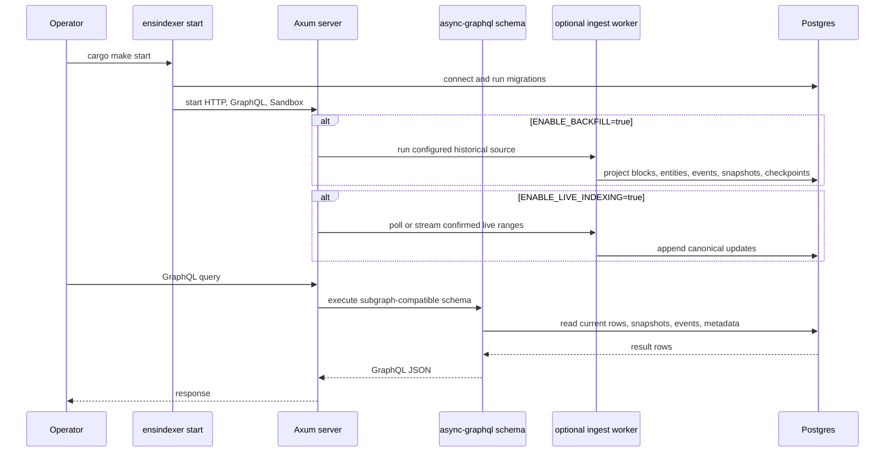

# ENS Indexer

`ensindexer` is a custom Rust implementation of the ENS subgraph. It indexes ENS registry, registrar, name wrapper, and resolver activity into Postgres and exposes an `async-graphql` API shaped to match the official ENS subgraph as closely as possible.

The project is built as a Cargo workspace with small crates for contracts, ingestion, projection, storage, API, server, CLI, and shared types. The runtime is one production binary: it serves GraphQL, Apollo Sandbox, health routes, optional historical backfill, optional live indexing, and raw archive replay.

## Start Here

- [Docs Index](docs/README.md): the curated knowledge base for architecture, indexing flow, compatibility, operations, performance, and future work.
- [Architecture](docs/architecture.md): how the crates work together.
- [Operations](docs/operations.md): how to run the service, backfills, raw archives, Docker, and status checks.
- [GraphQL Compatibility](docs/graphql-compatibility.md): official-subgraph schema surface, filters, relationships, and known gaps.
- [Performance](docs/performance-and-benchmarks.md): raw replay optimizations, query indexes, DataLoader work, and benchmark results.
- [Research Archive](research/README.md): older implementation research and official-subgraph notes kept for provenance.
- [Crate READMEs](crates): crate-level implementation notes.

## Quick Start

```bash
cp .env.example .env
cargo make db-up
cargo make start
```

Open Apollo Sandbox at:

```text
http://127.0.0.1:8080/graphql
```

The subgraph-compatible POST endpoint is:

```text
http://127.0.0.1:8080/subgraph
```

## Runtime Model



## Workspace

| Crate | Responsibility |
| --- | --- |
| `types` | Shared IDs, constants, log context, scalar helpers, and normalization helpers. |
| `contracts` | Alloy ABI bindings and typed ENS event decoding. |
| `config` | Strict `.env` and CLI flag configuration parsing. |
| `storage` | Postgres schema, repositories, filters, query builders, write buffers, snapshots, and maintenance. |
| `projection` | Official-subgraph-shaped state transitions from typed ENS events. |
| `ingest` | RPC, HyperSync, raw archive, and live indexing orchestration. |
| `api` | `async-graphql` schema, DTOs, filters, ordering, relationship resolvers, and `_meta`. |
| `server` | Axum routes, Apollo Sandbox, health checks, and indexing task supervision. |
| `cli` | Production binary with `start` and `status`. |

## Main Commands

```bash
# Start the unified API/indexer process.
cargo make start

# Print latest indexed block and per-source checkpoints.
cargo make status

# Run checks used during development.
cargo make check
cargo make test
```

The production binary intentionally has only two user-facing commands:

```bash
cargo run -p cli --bin ensindexer -- start
cargo run -p cli --bin ensindexer -- status
```

## Backfill Sources

Historical indexing is explicit. There is no automatic source selection.

```env
POSTGRES_DB=ensindexer
POSTGRES_USER=postgres
POSTGRES_PASSWORD=postgres
POSTGRES_HOST=localhost
POSTGRES_PORT=5432
ENABLE_BACKFILL=true
BACKFILL_SOURCE=rpc        # rpc | hypersync | raw
ENABLE_LIVE_INDEXING=false
INDEXER_CONFIRMATION_DEPTH=12
BACKFILL_LIVE_GAP_BLOCKS=10
```

When `ENABLE_BACKFILL=true` and `ENABLE_LIVE_INDEXING=true`, startup backfill stops at `latest - INDEXER_CONFIRMATION_DEPTH - BACKFILL_LIVE_GAP_BLOCKS`. If the remaining startup backfill span is already within `BACKFILL_LIVE_GAP_BLOCKS`, startup backfill is skipped and live indexing takes over from database checkpoint + 1.

Raw archives let you fetch logs once, store them locally, and replay projection repeatedly without spending RPC or HyperSync credits:

```bash
# Fetch and archive.
ENABLE_BACKFILL=true \
BACKFILL_SOURCE=hypersync \
ARCHIVE_BACKFILLS=true \
RAW_ARCHIVE_DIR=.raw-archive-full \
cargo make start

# Replay from local archive after a DB reset.
cargo make db-reset
cargo make db-up
ENABLE_BACKFILL=true \
BACKFILL_SOURCE=raw \
RAW_ARCHIVE_DIR=.raw-archive-full \
cargo make start
```

Raw archive files are binary `.bin` range payloads under `RAW_ARCHIVE_DIR/ranges`, with metadata and checksums in `manifest.json`.

## Compatibility Scope

Implemented compatibility includes:

- Official root query fields for current entities, events, event interfaces, and `_meta`.
- Current and historical entity reads with `block` arguments.
- Event clamping for historical event reads.
- `Domain`, `Registration`, `WrappedDomain`, `Resolver`, and `Account` entities.
- Registry, registrar, wrapper, and resolver event tables.
- Relationship fields and generated-style trailing-underscore filters.
- Scalar filters, boolean `and`/`or`, list operators, ordering, `_change_block`, and derived event collections.
- `/subgraph` endpoint for clients expecting The Graph-style routing.

See [GraphQL Compatibility](docs/graphql-compatibility.md) for details and known gaps.

## Performance Highlights

The indexer includes optimizations added from full-mainnet replay and query profiling:

- HyperSync historical fetch support.
- Binary raw archive replay with checksum manifest.
- Range-level write buffering and raw replay transactions.
- Replay-level current-state cache.
- Batched current rows, blocks, entity changes, snapshots, and event inserts.
- Temporary secondary-index drop/recreate for raw or HyperSync backfills spanning more than 500,000 blocks.
- Parent-first domain flushes for self-referential foreign keys.
- Hash-backed exact text indexes for long ENS names and labels.
- Trigram indexes for fuzzy name search.
- ENSJS-style names-for-address fast path.
- DataLoader batching for hot domain relationships.

See [Performance And Benchmarks](docs/performance-and-benchmarks.md).

## Docker

```bash
cargo make docker-build
cargo make docker-run
```

The container entrypoint runs `ensindexer start`. Configure backfill/live workers through `.env`.

## Documentation Map

The project documentation is split by audience:

- Root README: orientation and quick start.
- `docs/`: current implementation knowledge base.
- `research/`: archived research notes from official subgraph and ENSNode investigations.
- `crates/*/README.md`: crate-level implementation details.
- `benchmarks/README.md`: benchmark fixtures and current benchmark table.
- `TODOs.md`: implementation checklist and remaining production gaps.
