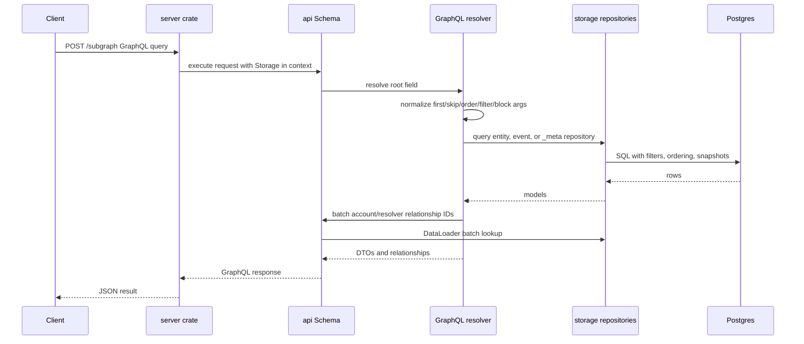

# api

The `api` crate exposes the ENS subgraph-compatible GraphQL schema with `async-graphql`. It is the read side of the indexer: resolvers translate official subgraph query shapes into storage filters, load rows from Postgres, and return DTOs whose field names, relationship names, filters, ordering enums, `block` arguments, and `_meta` behavior match the hosted ENS subgraph as closely as possible.

## Flow

## Projection Awareness

This crate does not project chain events. It consumes the projection results produced by `projection` and persisted by `storage`. For current reads, resolvers query current-state tables such as `domains`, `registrations`, `wrapped_domains`, `resolvers`, and `accounts`. For historical `block` reads, mutable entity roots query snapshot tables and event roots clamp rows by `block_number`.

Relationship fields are intentionally implemented as read-time joins, batched loads, or follow-up repository calls. Hot `Domain` account, resolver, registration, and wrapped-domain relationships use `async-graphql` DataLoader batching to avoid one SQL roundtrip per nested field in common search and profile queries. Other relationships such as `Registration.domain`, `WrappedDomain.owner`, `Resolver.domain`, and event parent links are still resolved from storage and are candidates for the same batching pattern. Derived collections such as `Domain.events`, `Registration.events`, `Resolver.events`, and account-derived domains/registrations/wrapped domains are also resolved from storage.

## Storage Shape Used

The API reads these storage families:

- Current entities: `accounts`, `domains`, `registrations`, `wrapped_domains`, `resolvers`.
- Historical snapshots: `account_snapshots`, `domain_snapshots`, `registration_snapshots`, `wrapped_domain_snapshots`, `resolver_snapshots`.
- Event tables: registry, registrar, wrapper, and resolver event tables.
- Chain metadata: `blocks` for `_meta` and block-hash lookup.
- Change metadata: `entity_changes` for `_change_block` filters.

The API should never mutate indexed data. Mutations belong to ingestion/projection/storage apply paths.

## Main Files

- `src/schema.rs` and `src/schema/*`: root query objects and official subgraph field wiring.
- `src/loaders.rs`: request-time DataLoader keys and batch loaders for hot entity relationships.
- `src/objects.rs` and `src/objects/*`: GraphQL DTOs and relationship resolvers.
- `src/filters.rs` and `src/filters/*`: official filter inputs, conversion to storage filters, `and`/`or`, relation predicates, and ordering enums.
- `src/meta.rs`: `_meta(block:)` response mapping.
- `src/pagination.rs`: shared `first`/`skip` handling.

## Summary

`api` is the compatibility boundary. Its job is to make the local Rust indexer look like the ENS subgraph to GraphQL clients while keeping all database-specific details behind `storage`.

## Implemented

- Official root fields for entities, concrete events, event interfaces, and `_meta`.
- Singular and plural reads for domains, accounts, registrations, wrapped domains, resolvers, and event rows.
- `block` arguments for current and historical reads.
- Snapshot-backed historical mutable entity queries.
- Event clamping for historical event reads.
- Relationship filters, `_change_block`, scalar operators, list operators, and ordering fields.
- DataLoader batching for `Domain.owner`, `Domain.resolvedAddress`, `Domain.registrant`, `Domain.wrappedOwner`, `Domain.resolver`, `Domain.registration`, and `Domain.wrappedDomain`.
- GraphQL schema diff support through the CLI.

## Future Improvements

- Expand DataLoader-style batching to registration, wrapped-domain, resolver-domain, and event-parent hydration paths.
- Expand official/local differential tests with real mainnet fixtures.
- Add query complexity and depth controls before public deployment.
- Profile expensive derived relationships and add targeted storage indexes.
- Audit deeper historical context propagation for nested relationship fields.
