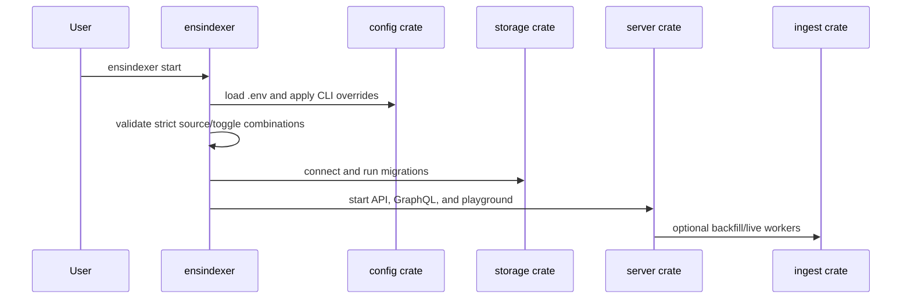

# cli

The `cli` crate builds the `ensindexer` production binary. It is intentionally small: operators start the unified service with one command and inspect checkpoint state with one status command.

## Flow

## Commands

- `ensindexer start`: starts health routes, GraphQL API, Apollo Sandbox, and optional indexing workers.
- `ensindexer status`: prints the latest indexed block and per-source checkpoints.

`start` accepts env variables and equivalent `--kebab-case` flags for the operational config: database URL, RPC URL, WSS URL, HyperSync URL/API key, raw archive directory, chain ID, bind address, backfill/live toggles, source selectors, archive writes, batch size, confirmation depth, and polling interval.

## Projection Awareness

The CLI does not project events itself. It validates configuration, opens storage, runs migrations, and delegates all indexing behavior to `server` and `ingest`.

Backfill behavior is controlled by:

- `ENABLE_BACKFILL=true`
- `BACKFILL_SOURCE=rpc|hypersync|raw`
- `ARCHIVE_BACKFILLS=true`
- `RAW_ARCHIVE_DIR=<path>`

Live behavior is controlled by:

- `ENABLE_LIVE_INDEXING=true`
- `LIVE_INDEXING_SOURCE=rpc|wss`

There is no automatic source selection and no `BACKFILL_FROM` or `BACKFILL_TO` setting. RPC and HyperSync resume from database checkpoints; raw replay resumes from archive coverage and database checkpoints.

## Storage Shape Used

The CLI owns no SQL table definitions. It connects through `storage`, runs the workspace migrations, and reads checkpoint/block status for the `status` command.

## Main Files

- `src/app.rs`: Clap definitions, startup validation, storage connection, and command dispatch.
- `src/main.rs`: Tokio runtime entrypoint with a larger worker stack for GraphQL/indexing workloads.

## Summary

`cli` is the stable production shell around the indexer. Development-only tools such as schema diffing, benchmarks, label healing, and comparison runners should live outside this public binary surface.

## Implemented

- `ensindexer start`.
- `ensindexer status`.
- Env and flag override support for startup config.
- Strict validation for raw replay, archive writes, HyperSync credentials, and WSS live indexing.
- Automatic migration execution on startup.

## Future Improvements

- Add machine-readable `status --json`.
- Add richer status output for indexing lag, active workers, and archive coverage.
- Move internal benchmark/schema/label-heal tooling into separate dev binaries or scripts.
