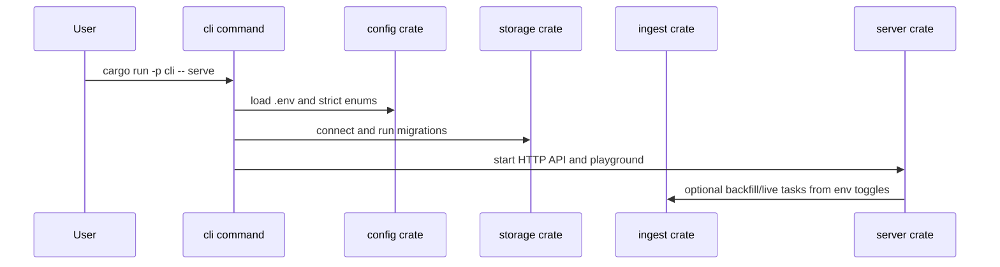

# cli

The `cli` crate is the operator entrypoint for the indexer. It wires configuration, migrations, server startup, backfills, archive replay, live indexing, schema checks, and reference-subgraph comparisons into explicit commands.

## Flow



## Commands

- `serve`: always starts health routes, GraphQL API, and Apollo Sandbox. Optional backfill/live indexing are controlled by env toggles.
- `migrate`: runs SQLx migrations.
- `status`: prints source checkpoints and indexed block state.
- `reset --yes`: deletes indexed tables for dev rebuilds.
- `backfill`: runs the configured historical source: `BACKFILL_SOURCE=rpc|hypersync|raw`.
- `archive [--archive-dir <dir>]`: archive-only mode. It fetches raw logs/blocks to `.bin` range files without projecting to Postgres.
- `replay [--archive-dir <dir>]`: replays binary archive ranges into Postgres.
- `archive-status [--archive-dir <dir>] [--verify]`: reports binary archive coverage and optionally verifies checksums.
- `labels-import --input <file>`: imports a local ENSRainbow streamed protobuf `.ensrainbow` file or TSV `labelhash<TAB>label` file into the local label dictionary.
- `labels-heal [--limit <n>] [--labelhash <hash>]`: repairs unknown labels from the local dictionary in the already-indexed database.
- `index`: runs live indexing only.
- `compare`: runs one GraphQL query against local and official subgraph endpoints and diffs JSON responses.
- `schema-local`: prints local GraphQL SDL.
- `schema-diff`: introspects the official subgraph and checks root fields, args, inputs, and enums.

## Projection Awareness

The CLI does not project events itself. It chooses which runtime path to invoke:

- `backfill` uses `ingest` to fetch, decode, project, batch-flush, and checkpoint.
- `archive` uses `ingest` to fetch raw data and write binary archive ranges plus metadata.
- `replay` uses `ingest` to read binary archive ranges and run the same projection apply path without RPC or HyperSync credits.
- `labels-import` and `labels-heal` use local files and storage tables to fill `label_preimages` and recompute affected domain names without runtime external API calls, resetting, or replaying. Operator scripts may download the local dictionary before import.
- `serve` delegates the always-on API to `server` and optional indexing to `server::runtime`.

## Storage Shape Used

The CLI opens Postgres through `storage`, runs migrations, and then delegates table reads/writes to the selected subsystem. It directly prints checkpoint and archive status but does not own SQL table definitions.

## Main Files

- `src/app.rs`: Clap command definitions and command dispatch.
- `src/compare.rs`: local-vs-official GraphQL comparison helper.
- `src/label_heal.rs`: local ENSRainbow file import and label repair command.
- `src/schema.rs` and `src/schema/*`: local SDL generation, official introspection, and schema compatibility diffing.
- `src/main.rs`: Tokio entrypoint.

## Summary

`cli` is the operational shell around the workspace. It keeps source selection explicit, makes destructive actions opt-in, and provides compatibility tooling for subgraph parity work.

## Local Label Healing

Use `scripts/ens-heal.sh` from the workspace root to download and verify ENSRainbow data into `healed-names/ens_names.sql.gz`, then extract `healed-names/ens_names.tsv`. Import that TSV with:

```bash
LABELS_FILE=healed-names/ens_names.tsv make labels-import
LABEL_HEAL_LIMIT=100000 make labels-heal
```

Importing before a fresh backfill gives projection a local dictionary during indexing. For an already-filled database, run import and heal after backfill. Large heal batches should not run at the same time as dense backfill ranges because the repair updates domain rows and rebuilds decoded names.

## Implemented

- Unified `serve` command with fixed API/playground and optional indexing toggles.
- Strict historical source selection: `rpc`, `hypersync`, or `raw`.
- Strict live source selection: `http_rpc` or `wss`.
- Binary archive-only, archive replay, and archive inspection commands.
- Schema diff and data compare commands for official subgraph compatibility.
- Local ENSRainbow dictionary import and label healing for post-backfill database repair.
- Dev helpers for migrations, status, reset, and live indexing.

## Future Improvements

- Add structured progress output formats for automation.
- Add richer status output for lag, ranges, archive coverage, and source health.
- Add safety prompts for reset in interactive terminals while keeping `--yes` for scripts.
- Add benchmark commands for replay throughput and GraphQL query latency.
