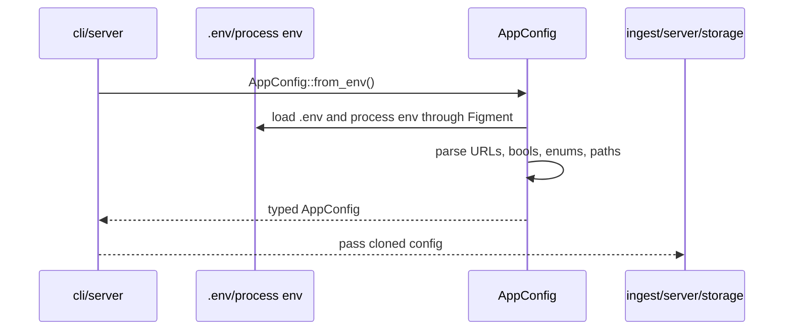

# config

The `config` crate loads runtime configuration from environment variables and converts them into typed values used by every other crate. It intentionally uses strict enums for indexing modes so production behavior is explicit.

## Flow

## Key Environment Variables

- `POSTGRES_DB`: Postgres database name.
- `POSTGRES_USER`: Postgres user.
- `POSTGRES_PASSWORD`: Postgres password.
- `POSTGRES_HOST`: Postgres host.
- `POSTGRES_PORT`: Postgres port, default `5432`.
- `ETH_RPC_URL`: HTTP JSON-RPC endpoint.
- `ENVIO_API_KEY`: HyperSync API key for `BACKFILL_SOURCE=hypersync`.
- `HYPERSYNC_URL`: HyperSync endpoint, defaulting to Ethereum mainnet HyperSync.
- `ENABLE_BACKFILL`: serve-time historical indexing toggle.
- `ENABLE_LIVE_INDEXING`: serve-time live indexing toggle.
- `BACKFILL_SOURCE`: strict enum `rpc|hypersync|raw`.
- `ARCHIVE_BACKFILLS`: write fetched historical ranges into the raw archive.
- `RAW_ARCHIVE_DIR`: archive root containing `manifest.json` and `ranges/*.bin`.
- `CHAIN_ID`: expected chain id, default `1`.
- `BIND_ADDRESS`: HTTP bind address.
- `INDEXER_CONFIRMATION_DEPTH`: live indexing confirmation buffer.
- `BACKFILL_LIVE_GAP_BLOCKS`: extra gap between startup backfill and live indexing when both are enabled, default `10`.
- `BACKFILL_BATCH_BLOCKS`: historical range size.
- `LIVE_POLL_SECONDS`: HTTP polling interval for live indexing.

There are no `BACKFILL_FROM` or `BACKFILL_TO` variables. Historical backfill resumes from database checkpoints, and raw replay resumes from archive/database state.

## Projection Awareness

Configuration controls how projection is reached but does not project data. `BACKFILL_SOURCE` selects the historical transport, `ARCHIVE_BACKFILLS` decides whether fetched data is persisted as raw binary ranges, and `ENABLE_*` toggles decide which workers `ensindexer start` enables. When backfill and live indexing are both enabled, startup backfill stops at `latest - INDEXER_CONFIRMATION_DEPTH - BACKFILL_LIVE_GAP_BLOCKS`; live indexing owns the newer confirmed blocks.

## Storage Shape Used

This crate does not access storage. It builds a Postgres connection URL from component environment variables and supplies operational knobs that storage and ingest use.

## Main Files

- `src/env.rs`: `AppConfig`, strict enums, Figment env loading, Postgres URL construction, URL parsing, and error types.
- `src/lib.rs`: public exports.

## Summary

`config` is the contract for running the indexer. It keeps production behavior descriptive, strict, and easy to audit from `.env`.

## Implemented

- Figment-backed `.env` and process environment loading.
- Required Postgres component and RPC config.
- Optional HyperSync, archive, and bind settings.
- Strict backfill and live indexing source enums.
- Serve-time backfill/live toggles.
- Default values for mainnet, confirmation depth, batch size, and polling.

## Future Improvements

- Move startup combination validation from the CLI into this crate if other binaries need the same checks.
- Add redacted config diagnostics for startup logs.
- Add per-source timeout/retry settings.
- Add environment profiles for dev, staging, and production.
