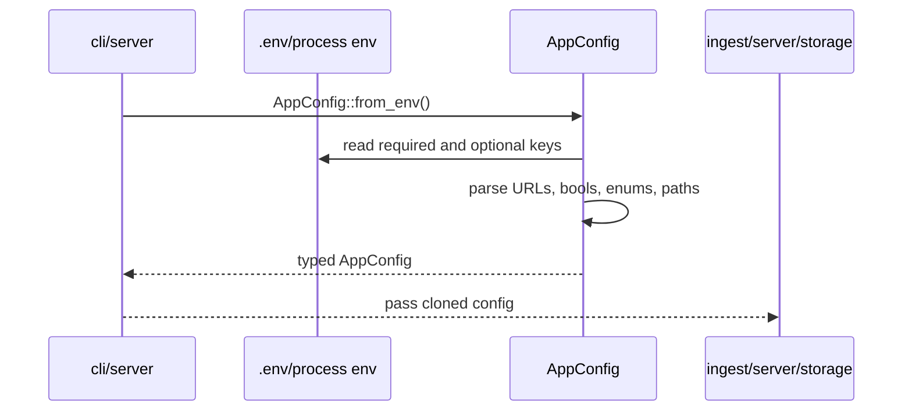

# config

The `config` crate loads runtime configuration from environment variables and converts them into typed values used by every other crate. It intentionally uses strict enums for indexing modes so production behavior is explicit.

## Flow

## Key Environment Variables

- `DATABASE_URL`: Postgres connection string.
- `ETH_RPC_URL`: HTTP JSON-RPC endpoint.
- `ETH_WS_URL`: WebSocket endpoint for `INDEXING_SOURCE=wss`.
- `ENVIO_API_KEY`: HyperSync API key for `BACKFILL_SOURCE=hypersync`.
- `HYPERSYNC_URL`: HyperSync endpoint, defaulting to Ethereum mainnet HyperSync.
- `ENSRAINBOW_URL`: ENSRainbow endpoint used by `labels-heal`, defaulting to `https://api.ensrainbow.io`.
- `ENABLE_BACKFILL`: serve-time historical indexing toggle.
- `ENABLE_LIVE_INDEXING`: serve-time live indexing toggle.
- `BACKFILL_SOURCE`: strict enum `rpc|hypersync|raw`.
- `INDEXING_SOURCE`: strict enum `http_rpc|wss`.
- `ARCHIVE_BACKFILLS`: write fetched historical ranges into the raw archive.
- `RAW_ARCHIVE_DIR`: archive root containing `manifest.json`, `resolvers.json`, and `ranges/*.bin`.
- `CHAIN_ID`: expected chain id, default `1`.
- `BIND_ADDRESS`: HTTP bind address.
- `INDEXER_CONFIRMATION_DEPTH`: live indexing confirmation buffer.
- `BACKFILL_BATCH_BLOCKS`: historical range size.
- `LIVE_POLL_SECONDS`: HTTP polling interval for live indexing.

There are no `BACKFILL_FROM` or `BACKFILL_TO` variables. Historical backfill resumes from database checkpoints, raw replay resumes from archive/database state, and archive-only resumes from the last archived range.

## Projection Awareness

Configuration controls how projection is reached but does not project data. `BACKFILL_SOURCE` selects the historical transport, `ARCHIVE_BACKFILLS` decides whether fetched data is persisted as raw binary ranges, and `ENABLE_*` toggles decide which services `serve` starts.

## Storage Shape Used

This crate does not access storage. It supplies the database URL and operational knobs that storage and ingest use.

## Main Files

- `src/env.rs`: `AppConfig`, strict enums, env parsing, URL parsing, and error types.
- `src/lib.rs`: public exports.

## Summary

`config` is the contract for running the indexer. It keeps production behavior descriptive, strict, and easy to audit from `.env`.

## Implemented

- Required database and RPC config.
- Optional WebSocket, HyperSync, archive, and bind settings.
- Strict backfill and live indexing source enums.
- Serve-time backfill/live toggles.
- Default values for mainnet, confirmation depth, batch size, and polling.

## Future Improvements

- Add config validation for incompatible combinations, such as `BACKFILL_SOURCE=raw` without `RAW_ARCHIVE_DIR`.
- Add redacted config diagnostics for startup logs.
- Add per-source timeout/retry settings.
- Add environment profiles for dev, staging, and production.
