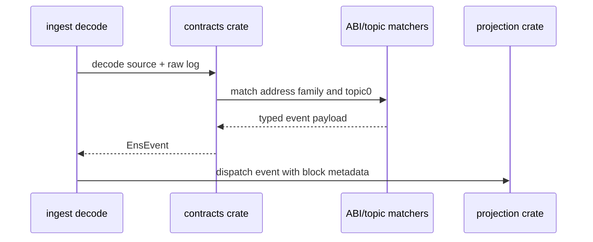

# contracts

The `contracts` crate owns Ethereum ABI knowledge for the ENS indexer. It defines the indexed contract/event surface and converts Alloy logs into strongly typed ENS events used by projection.

## Flow

## Indexed Event Families

- ENS registry: ownership, resolver, TTL, and transfer-style domain events.
- ETH registrar controller/base registrar: registrations, renewals, and transfers.
- Name wrapper: wrap, unwrap, fuse, expiry, and owner transfer events.
- Public resolver and resolver-compatible contracts: address records, multicoin records, names, ABI, pubkey, text, contenthash, interface, authorisation, and version events.

## Projection Awareness

This crate stops at decoding. It preserves enough typed data for `projection` to build official subgraph entities and event rows. It also separates fixed-source logs from dynamically discovered resolver logs so `ingest` can keep resolver discovery complete during archive and live indexing.

## Storage Shape Used

No database access is performed here. Event types map one-to-one or many-to-one into storage inserts later:

- Registry events feed domain event tables and current `domains`.
- Registrar events feed registration event tables and `registrations`.
- Wrapper events feed wrapper event tables and `wrapped_domains`.
- Resolver events feed resolver event tables and current `resolvers`.

## Main Files

- `src/abi.rs`: ABI bindings and common decode helpers.
- `src/events.rs` and `src/events/*`: event enum definitions, fixed-source decoding, resolver decoding, shared event helpers, and topic mapping.
- `src/model.rs`: shared decoded model types.
- `src/lib.rs`: public exports.

## Summary

`contracts` is the typed boundary between raw EVM logs and the rest of the Rust indexer. Keeping ABI logic here prevents projection and ingestion code from depending on topic literals directly.

## Implemented

- Alloy-based log decoding.
- Typed ENS event enum covering registry, registrar, wrapper, and resolver events.
- Topic-based event identification.
- Fixed-source and resolver-source decode paths.
- Tests for important helper behavior through downstream projection/ingest paths.

## Future Improvements

- Add ABI conformance tests against known transaction receipts from mainnet.
- Add generated ABI metadata documentation for every event signature.
- Add decode metrics by event type and unknown topic.
- Add explicit support for any additional resolver-compatible contracts found during mainnet audits.
