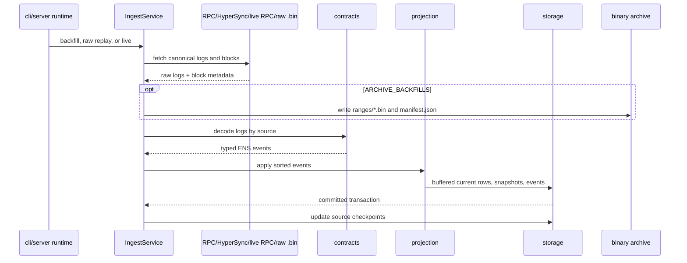

# ingest

The `ingest` crate moves chain data into the projection pipeline. It fetches logs and block metadata from RPC, HyperSync, live RPC polling, or binary raw archives; decodes events; applies projection handlers; writes storage batches; checkpoints progress; and maintains raw archive metadata for repeatable backfills.

## Flow

## Projection Path

All historical fill modes share the same buffered apply path:

1. Fetch or read one block range.
2. Merge all active fixed sources and dynamic resolver sources.
3. Sort logs by block number, transaction index, and log index.
4. Decode each log into a typed ENS event.
5. Dispatch the event to `projection`.
6. Buffer current-state mutations, append-only event rows, entity changes, snapshots, and block rows.
7. Flush current rows in dependency order, including parent-first domain writes.
8. Flush snapshots and event rows in chunks below Postgres bind limits.
9. Commit the range transaction and write checkpoints.

Raw replay reads one `.bin` file at a time, prefetches the next file, keeps a replay-level projection cache across files, and can temporarily drop secondary query indexes before bulk replay. Secondary indexes are dropped only when the requested raw or HyperSync range spans more than 500,000 blocks; short catchups keep indexes online. Startup HyperSync backfill uses the same thresholded maintenance window so dense historical ranges keep the same write-throughput profile as raw replay.

When live indexing is enabled together with backfill, historical backfill stops at `latest - INDEXER_CONFIRMATION_DEPTH - BACKFILL_LIVE_GAP_BLOCKS`. Live indexing starts after backfill completes, resumes from the minimum source checkpoint + 1, and always uses `ETH_RPC_URL`, so `BACKFILL_SOURCE=hypersync` does not cause live polling to fetch logs through HyperSync.

## Binary Archive Format

Range payloads are binary-only files under `RAW_ARCHIVE_DIR/ranges/{from}-{to}.bin`. They are MessagePack-encoded `ArchivedRange` values containing:

- chain id
- from/to block bounds
- ordered `(LogSource, Log)` raw logs
- block metadata needed by `_meta`, snapshots, and reorg checks
- source checkpoints represented by the archived range

The archive root also contains:

- `manifest.json`: range list, byte lengths, log counts, and SHA-256 checksums.

JSON range payloads are no longer supported. Metadata files remain JSON because they are small, human-inspectable control files.

## Storage Shape Used

Ingestion writes:

- `blocks` for indexed block metadata.
- `source_checkpoints` per fixed source and resolver source.
- Current entities through projection: `accounts`, `domains`, `registrations`, `wrapped_domains`, `resolvers`.
- Snapshot tables for historical `block` reads.
- Event tables for all registry, registrar, wrapper, and resolver events.
- `entity_changes` for `_change_block` filters and snapshot flushing.

## Main Files

- `src/service.rs`: `IngestService` facade.
- `src/service/backfill.rs`: RPC/HyperSync source selection, checkpoint resume logic, optional archive writing, and range orchestration.
- `src/service/apply.rs`: shared transactional buffered apply path.
- `src/service/replay.rs`: binary archive replay, prefetch, and replay index maintenance.
- `src/service/live.rs`: live indexing, confirmation depth, parent-hash checks, and reorg repair.
- `src/archive.rs` and `src/archive/*`: binary range IO, manifest/checksum coverage, resolver cache, and archive models.
- `src/rpc.rs`: Alloy RPC log and block fetching.
- `src/hypersync.rs`: Envio HyperSync historical fetching.
- `src/decode.rs`: source-aware decode bridge.
- `src/sources.rs`: ENS fixed source definitions and deployment blocks.

## Summary

`ingest` is the write-side runtime. It is designed so expensive data acquisition can be archived once, then projection logic can be changed and replayed from local binary files without spending RPC or HyperSync credits.

## Implemented

- Historical RPC backfill.
- Historical HyperSync backfill.
- Binary raw archive writing during RPC/HyperSync backfills.
- Binary raw archive replay.
- Manifest coverage inspection and checksum verification.
- Resolver discovery from registry logs and existing resolver rows.
- Shared batched projection apply path for RPC, HyperSync, raw replay, and live ranges.
- HyperSync bulk backfill index maintenance matching raw replay.
- Backfill/live range separation to prevent duplicate fresh-block fetching.
- Live indexing through confirmed HTTP RPC polling.
- Confirmation-depth handling and parent-hash reorg detection.
- Coarse reorg repair by reset and rebuild.
- Replay performance features: prefetch, replay-level cache, batched current/entity/event writes, block batch writes, and thresholded temporary secondary-index drop/recreate.

## Future Improvements

- Replace coarse reorg reset with efficient common-ancestor rollback.
- Add reversible change payloads or snapshot-assisted rollback.
- Add source-level retry/backoff policies and dead-letter diagnostics.
- Add ingest metrics for logs/sec, rows/sec, lag, SQL time, archive IO, and source errors.
- Add adaptive range sizing for dense resolver eras.
- Add binary archive format versioning tests and migration planning before public releases.
