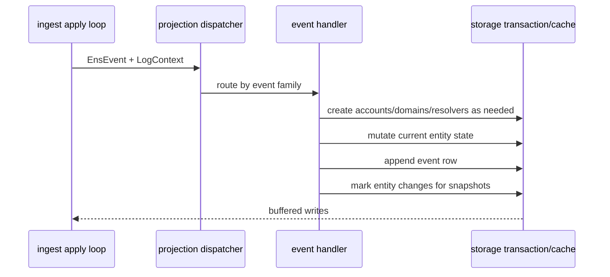

# projection

The `projection` crate turns typed ENS events into official-subgraph-shaped entity changes and event rows. It is intentionally storage-facing but transport-agnostic: RPC, HyperSync, raw replay, and live indexing all call the same handlers through `ingest`.

## Flow

## Projection Rules

Projection follows the official ENS subgraph model:

- Registry events create/update `Domain` ownership, parent links, resolver links, TTL, migration flags, and domain event rows.
- Registrar events create/update `Registration` state, registrant links, expiry, costs, and registration event rows.
- Wrapper events create/update `WrappedDomain` ownership, fuses, expiry, tombstones, and wrapper event rows.
- Resolver events create/update `Resolver` records: address, multicoin addresses, name, ABI, pubkey, text keys, contenthash, interface implementers, authorisations, and version.
- Account rows are created for every address referenced by projected relationships.
- Registrar/controller and wrapper events persist valid label preimages, and registry events use those preimages before falling back to bracketed `[labelhash]` names.
- Entity changes are emitted whenever mutable current state changes so historical snapshots and `_change_block` filters work.

Event IDs and entity IDs are generated using helper functions that mirror documented subgraph-compatible shapes.

## Storage Shape Used

Projection writes through storage abstractions rather than SQL directly:

- Current entities: `accounts`, `domains`, `registrations`, `wrapped_domains`, `resolvers`.
- Append-only event tables for every decoded event type.
- `label_preimages` for cached labelhash-to-label lookups during dense backfills and live indexing.
- `entity_changes` markers.
- Snapshot writes are performed by the storage change buffer from dirty projected entities.

## Main Files

- `src/handlers/dispatcher.rs`: routes `EnsEvent` variants to specific handlers.
- `src/handlers/registry.rs`: registry/domain ownership, resolver, TTL, and transfer projections.
- `src/handlers/registrar.rs`: registration, renewal, and registrar transfer projections.
- `src/handlers/wrapper.rs`: name wrapper projections.
- `src/handlers/resolver.rs`: resolver record projections.
- `src/support.rs`: common ID, account/domain creation, and helper logic.
- `src/error.rs`: projection error type.
- `src/lib.rs`: public projection API.

## Summary

`projection` contains the domain rules of the indexer. If official-subgraph behavior changes or a compatibility gap appears in projected data, this is the first crate to inspect.

## Implemented

- Registry, registrar, wrapper, and resolver event handlers.
- Current-state updates for all main ENS entities.
- Append-only event row construction.
- Account/domain/resolver create-if-missing behavior.
- Entity change markers for snapshot-backed historical reads.
- Tombstones for wrapped-domain deletion semantics.
- Persistent label-preimage healing for registry names using labels observed from registrar/controller and wrapper events.
- ID and name helper tests through shared utilities.

## Future Improvements

- Add dense fixture tests per event family using known mainnet receipts.
- Add official/local differential projection tests for representative domains.
- Add ENSRainbow or another external `ens.nameByHash` dictionary source for labels that never appear as event string preimages.
- Audit edge cases around unknown labels, resolver replacement, wrapper unwrap/re-wrap, and same-block repeated mutations.
- Add structured projection trace output for debugging one entity across a range.
