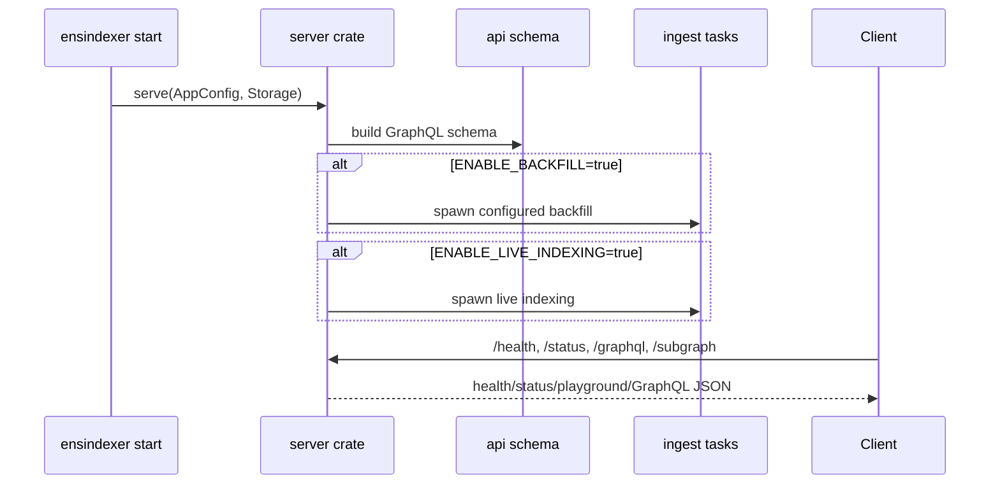

# server

The `server` crate runs the HTTP service and optional indexing tasks in one process. It uses Axum for routes, Tower middleware, `async-graphql-axum` for GraphQL execution, and the workspace crates for storage, API schema, and ingestion runtime.

## Flow

## Runtime Behavior

`serve` always starts:

- Health/status routes.
- GraphQL API endpoint.
- Apollo Sandbox playground in both dev and production.

Backfill and live indexing are optional and controlled only by `ENABLE_BACKFILL` and `ENABLE_LIVE_INDEXING`. The transport choices come from `BACKFILL_SOURCE` and `LIVE_INDEXING_SOURCE`; there is no automatic source selection.

## Projection Awareness

The server does not project events directly. It spawns `ingest` tasks with cloned config/storage handles. The GraphQL API remains available while indexing catches up, which lets operators inspect partial state and `_meta` during backfill.

## Storage Shape Used

The server owns a shared `Storage` handle for request resolvers and indexing tasks. API routes read from storage, while optional ingest tasks write current entities, events, snapshots, blocks, and checkpoints.

## Main Files

- `src/http.rs`: Axum router, GraphQL handlers, health/status routes, and Apollo Sandbox.
- `src/runtime.rs`: optional backfill/live task startup and task supervision.
- `src/lib.rs`: public serve entrypoint.

## Summary

`server` is the production process wrapper: one binary can serve GraphQL, show the playground, catch up historical data, and continue live indexing.

## Implemented

- Axum HTTP server.
- `/subgraph` GraphQL endpoint.
- Always-on `/graphql` Apollo Sandbox.
- Health/status routes.
- Optional serve-time backfill.
- Optional serve-time live indexing.
- Shared storage wiring for API and ingest.

## Future Improvements

- Add graceful shutdown that drains in-flight GraphQL requests and commits/aborts indexing ranges cleanly.
- Add Prometheus/OpenTelemetry metrics.
- Add readiness checks based on DB connectivity and indexing lag.
- Add task failure reporting to `/status`.
