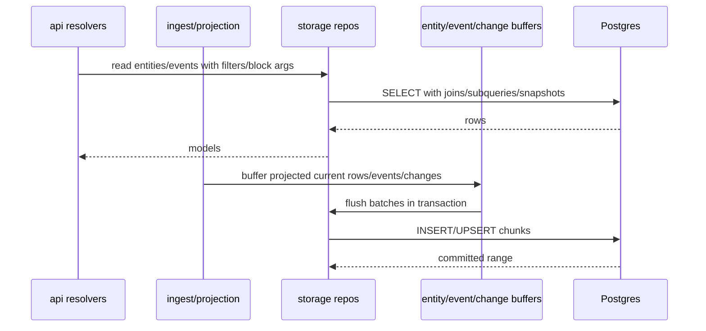

# storage

The `storage` crate owns Postgres persistence, SQL query building, repositories, batch write buffers, migrations, maintenance operations, and snapshot support. It is the only crate that should know table names and SQL details.

## Flow



## Tables And Relationships

Current entities:

- `accounts(id)`.
- `domains(id, name, label_name, labelhash, parent_id, owner_id, registrant_id, wrapped_owner_id, resolver_id, resolved_address_id, expiry_date, ttl, subdomain_count, is_migrated, created_at)`.
- `registrations(id, domain_id, registrant_id, registration_date, expiry_date, cost)`.
- `wrapped_domains(id, domain_id, owner_id, expiry_date, fuses, deleted)`.
- `resolvers(id, domain_id, address, addr_id, content_hash, texts, coin_types, record fields)`.

Operational tables:

- `blocks(number, hash, parent_hash, timestamp)`.
- `source_checkpoints(source, block_number, block_hash)`.
- `entity_changes(entity_type, entity_id, block_number)`.
- `label_preimages(labelhash, label_name)` for persisted `ens.nameByHash`-style label healing observed from registrar/controller and wrapper events or imported from ENSRainbow.

Snapshot tables:

- `account_snapshots`.
- `domain_snapshots`.
- `registration_snapshots`.
- `wrapped_domain_snapshots`.
- `resolver_snapshots`.

Event tables:

- Registry/domain: `transfer_events`, `new_owner_events`, `new_resolver_events`, `new_ttl_events`.
- Registrar/registration: `name_registered_events`, `name_renewed_events`, `name_transferred_events`.
- Wrapper: `wrapped_transfer_events`, `name_wrapped_events`, `name_unwrapped_events`, `fuses_set_events`, `expiry_extended_events`.
- Resolver: `addr_changed_events`, `multicoin_addr_changed_events`, `name_changed_events`, `abi_changed_events`, `pubkey_changed_events`, `text_changed_events`, `contenthash_changed_events`, `interface_changed_events`, `authorisation_changed_events`, `version_changed_events`.

Important relationships include domain parent self-reference, domain owner/registrant/wrapped owner account links, domain resolver link, resolver address account link, registration domain/registrant links, and wrapped-domain domain/owner links.

## Projection Support

Storage receives projected writes from `projection` through an ingest transaction. It supports high-throughput replay by batching:

- current-state upserts through `EntityCache`
- append-only events through `EventBuffer`
- block metadata through `BlocksRepo::upsert_many`
- entity changes and snapshots through `ChangeBuffer`

Dirty current rows are flushed before snapshots, with domains flushed parent-first to satisfy the `domains.parent_id` foreign key. Replay maintenance can drop and recreate secondary query indexes around bulk raw archive replay.

Domain exact `name` and `label_name` filters use MD5 expression indexes plus exact text rechecks so lookups stay fast without unsafe btree indexes over arbitrarily large on-chain strings. `labelhash` has a normal btree index because it is fixed-size hex text.

The secondary index set is based on the official ENSNode/Ponder schema and local full-mainnet query plans:

- trigram indexes for fuzzy/nocase `Domain.name` and `Domain.labelName` queries;
- relation indexes for `Domain.parent`, `owner`, `registrant`, `wrappedOwner`, `resolver`, and `resolvedAddress`;
- sort indexes for ENSJS-style names-for-address queries over `owner`, `registrant`, `wrappedOwner`, and `resolvedAddress` by `expiryDate` and `createdAt`;
- `Registration.domain`, `Registration.registrant`, `registrationDate`, and `expiryDate`;
- `WrappedDomain.domain` and `WrappedDomain.owner`;
- `Resolver.domain`, `Resolver.address`, and `Resolver.addr`;
- compound `(parent_id, id)` style indexes on all derived event tables for `Domain.events`, `Registration.events`, and `Resolver.events`.

## Query Support

Storage query builders map official GraphQL filters into SQL:

- scalar predicates
- `and`/`or` composition
- relation predicates with trailing-underscore filters
- derived collection subqueries
- `_change_block`
- ordering by scalar and relationship fields
- historical snapshot reads for `block` arguments
- event-interface filtering across concrete event tables

The repository also contains a specialized fast path for the common ENSJS names-for-address query shape:

```graphql
domains(where: {
  and: [
    { or: [{ owner: $addr }, { registrant: $addr }, { wrappedOwner: $addr }, { resolvedAddress: $addr }] }
    { or: [{ expiryDate_gt: $now }, { expiryDate: null }] }
  ]
}, orderBy: expiryDate, orderDirection: desc)
```

That path keeps the same GraphQL semantics but emits direct indexed predicates over the four address columns. On the local full-mainnet database this changed warm `/subgraph` latency from multi-second plans to roughly 18-22ms.

The account, resolver, registration, and wrapped-domain repositories also expose batch lookup methods used by the API DataLoader layer. These methods keep nested GraphQL relationship hydration from issuing one point-query per returned domain row.

## Main Files

- `src/store.rs`: `Storage` connection and repository accessors.
- `src/repositories/*`: entity, event, block, checkpoint, snapshot, and maintenance repositories.
- `src/repositories/domains/fast_address.rs`: optimized ENSJS-style domain lookup by owner/registrant/wrapped owner/resolved address.
- `src/query/*`: SQL predicate, relation, scalar, array, and select builders.
- `src/filters/*`: storage-level filter models consumed by API conversions.
- `src/entity_cache.rs`: current-state projection cache and dirty flushes.
- `src/event_buffer.rs`: append-only event batch buffer.
- `src/change_buffer.rs`: entity change and snapshot buffer.
- `src/maintenance.rs` and `src/maintenance/*`: reset and replay index maintenance.
- `src/models.rs` and `src/inserts.rs`: row and insert DTOs.

## Summary

`storage` is both the persistence layer and the SQL compatibility layer. Its responsibilities are correctness of table shape, historical reads, official filter semantics, and write throughput.

## Implemented

- SQLx Postgres migrations and repositories.
- Current entity, event, block, checkpoint, change, and snapshot tables.
- Batched current-state, event, block, and snapshot writes.
- Historical snapshot reads for mutable entities.
- Event clamping by historical block.
- Official filter/order SQL generation for entities and events.
- Derived relationship filters and event-interface filters.
- Replay index drop/recreate maintenance.
- Label-preimage persistence, local ENSRainbow imports, and cache-backed reads for projection-time label healing.
- Hash-backed domain lookup indexes for exact `name` and `labelName` GraphQL filters.
- ENSNode/Ponder-inspired trigram, relation, sort, and derived-event compound indexes.
- Fast indexed address lookup for high-volume ENSJS names-for-address queries.
- Batch account, resolver, registration, and wrapped-domain lookup helpers for GraphQL relationship DataLoader hydration.
- Query-builder tests for scalar, relation, order, and event predicates.

## Future Improvements

- Add query plan regression tests for expensive GraphQL filters.
- Add query-plan regression tests for the ENSJS address fast path and other representative GraphQL workloads.
- Add more indexes based on full mainnet workload profiling.
- Add automated scheduling/metrics around local dictionary label repair for production deployments that need continuous dictionary parity.
- Add partitioning or hypertable-style strategies for very large event tables if Postgres plans degrade.
- Add common-ancestor rollback primitives.
- Add migration checks that compare DB schema against generated documentation.
