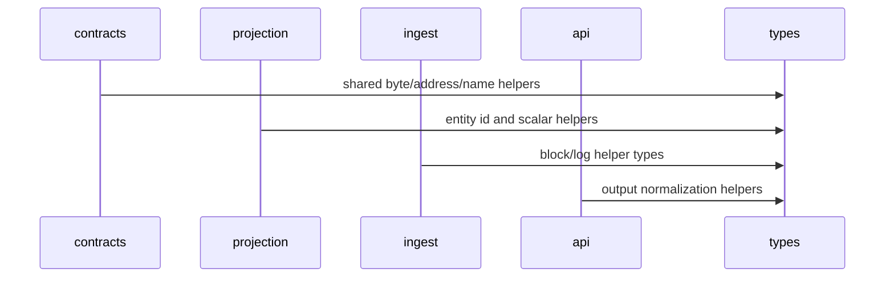

# types

The `types` crate contains small shared domain helpers that are useful across contracts, projection, ingest, API, and storage without pulling those crates into each other.

## Flow

## Projection Awareness

Shared helpers here support projection ID and value normalization, but this crate does not decide how ENS events mutate entities. It stays dependency-light to avoid cycles.

## Storage Shape Used

No storage access occurs here. Values produced by this crate may become entity IDs, event IDs, or normalized strings stored by `storage`.

## Main Files

- `src/core.rs`: shared primitives and helper functions.
- `src/lib.rs`: public exports.

## Summary

`types` is the low-level shared vocabulary for the workspace. It should stay small and stable.

## Implemented

- Shared core helper module.
- Workspace-level exports for cross-crate use.

## Future Improvements

- Move additional duplicated primitive helpers here only when multiple crates genuinely need them.
- Add property tests for encoding/normalization helpers as the shared surface grows.
- Keep this crate free of storage, API, and transport dependencies.
