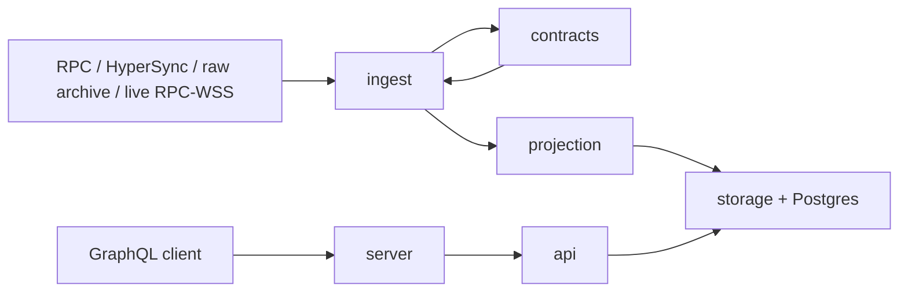

# ENS Indexer Docs

This directory is the maintained knowledge base for the Rust ENS indexer. It describes the current system, not the historical research trail. Older exploratory notes were moved to [`../research`](../research).

## Reading Order

If you are new to ENS indexing, read in this order. The early pages explain the moving parts before the later pages get into compatibility and performance details.

1. [Architecture](architecture.md): crate boundaries and end-to-end flow.
2. [Operations](operations.md): how to run the service, backfill, replay raw archives, and deploy with Docker.
3. [Ingestion And Archives](ingestion-and-archives.md): how logs enter the system and how raw archives work.
4. [Projection And Storage](projection-and-storage.md): how ENS events become current rows, snapshots, and event history.
5. [GraphQL Compatibility](graphql-compatibility.md): official ENS subgraph schema shape, filters, relationships, and gaps.
6. [Performance And Benchmarks](performance-and-benchmarks.md): optimizations and benchmark comparisons.
7. [Future Work](future-work.md): production-hardening and compatibility backlog.

The docs intentionally repeat a few important concepts, such as projection cache, batched writes, and query indexes. That repetition is deliberate: these are the concepts that explain most correctness and performance behavior in the project.

## System Overview

The write side is deterministic: every source mode feeds the same decode and projection path. The read side is compatibility-focused: GraphQL resolvers map official ENS subgraph query shapes to SQL over current tables, snapshot tables, and event tables.

## What Is Current

- Production CLI: `ensindexer start` and `ensindexer status`.
- Runtime: one process for HTTP, GraphQL, Apollo Sandbox, optional backfill, and optional live indexing.
- Historical sources: RPC, HyperSync, and local raw archive replay.
- Archive format: binary `.bin` range files plus `manifest.json`.
- Storage: Postgres with current tables, event tables, snapshot tables, indexed blocks, source checkpoints, and query indexes.
- API: `async-graphql` schema shaped for official ENS subgraph compatibility.

## What Is Research

The moved [`../research`](../research) directory contains:

- official ENS subgraph implementation notes;
- early Rust implementation planning;
- schema and GraphQL shape research;
- projection research;
- historical implementation roadmap notes.

Use those files when you need provenance or want to compare the current implementation against the original official subgraph research. Use this `docs/` directory for operating and extending the current Rust codebase.
