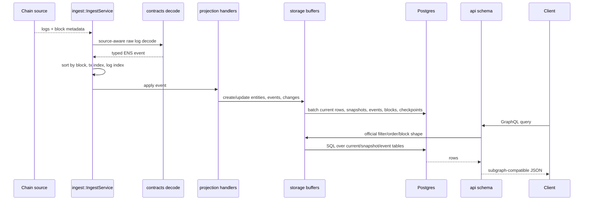

# Architecture

The indexer is split into crates so each layer has one clear job. The important design rule is that all write sources converge into the same deterministic projection path, and all read queries go through the same storage-backed GraphQL compatibility layer.

## Crate Boundaries

| Crate | Owns | Does Not Own |
| --- | --- | --- |
| `types` | shared IDs, constants, block/log context helpers | ABI decoding, SQL, GraphQL |
| `contracts` | Alloy ABI bindings and event decoding | projection rules, storage writes |
| `config` | typed runtime config from env | startup validation that needs storage |
| `storage` | SQL schema, repositories, filters, buffers, snapshots, indexes | ABI decoding, HTTP, ENS event semantics |
| `projection` | ENS event to subgraph entity/event rules | fetching logs, GraphQL response formatting |
| `ingest` | backfill/live/archive orchestration and shared apply loop | HTTP serving, public GraphQL schema |
| `api` | subgraph-compatible GraphQL schema | mutation/projection writes |
| `server` | Axum routes and indexing task supervision | low-level projection or query SQL |
| `cli` | production binary commands and startup validation | dev-only benchmark/schema tools |

## End-To-End Flow

## Runtime Modes

The same binary supports four operational modes by configuration:

| Mode | Config | Result |
| --- | --- | --- |
| API only | `ENABLE_BACKFILL=false`, `ENABLE_LIVE_INDEXING=false` | Serve GraphQL over existing DB state. |
| Startup backfill | `ENABLE_BACKFILL=true` | Catch up from checkpoints using RPC, HyperSync, or raw archive. |
| Live indexing | `ENABLE_LIVE_INDEXING=true` | Continue indexing confirmed blocks after startup. |
| Unified catchup + live | both toggles true | Backfill first, then live indexing. |

The server binds the HTTP listener before spawning indexing tasks. This prevents mutating the database when the API cannot start, for example if the port is already occupied.

## Write-Side Invariants

- Logs are applied in canonical chain order.
- Every source mode uses the same projection handlers.
- Current-state writes are buffered and flushed after projection.
- Domains flush parent-first to satisfy `domains.parent_id`.
- Event rows flush after current rows so event foreign keys are valid.
- Source checkpoints advance only after the range is applied.
- Raw replay wraps each range in a transaction with `synchronous_commit=off`.
- Raw replay and HyperSync startup backfill can drop secondary query indexes before large backfills over 500,000 blocks and recreate them after.

## Read-Side Invariants

- The API does not mutate indexed state.
- Current entity reads query current tables.
- Historical mutable entity reads use snapshot tables.
- Historical event reads clamp event rows by `block_number`.
- `_meta` reads indexed block metadata from `blocks`.
- `_change_block` filters use `entity_changes`.
- GraphQL relationship fields are resolved through joins, subqueries, repositories, or DataLoader batches.

## Why The Workspace Is Split This Way

This design keeps the most volatile logic isolated:

- ABI changes stay in `contracts`.
- Official subgraph compatibility changes stay mostly in `api` and `storage` filters.
- Projection correctness changes stay in `projection`.
- Backfill performance work stays in `ingest` and `storage` buffers.
- Operator UX stays in `cli`, `server`, and `config`.

That separation matters because the indexer is both a data pipeline and a compatibility API. Each part can be tested and optimized without turning the whole project into one large runtime module.
