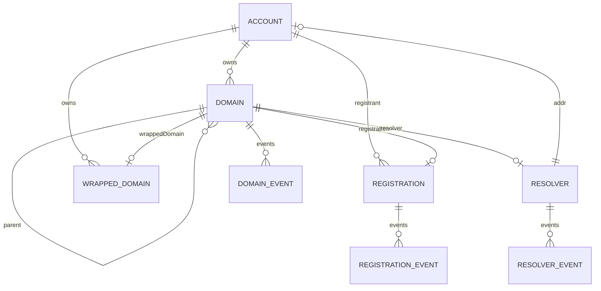

# GraphQL Compatibility

The API is designed to be a drop-in replacement for the official ENS subgraph schema and common client query shapes. The local schema is treated as the source of truth for this project; ENSNode compatibility quirks are handled only in benchmark tooling and are not allowed to change the canonical local schema.

## Endpoints

| Path | Purpose |
| --- | --- |
| `POST /graphql` | Primary GraphQL endpoint. |
| `GET /graphql` | Apollo Sandbox. |
| `POST /subgraph` | The Graph-style subgraph endpoint alias. |
| `GET /healthz` | Liveness. |
| `GET /readyz` | DB readiness. |

## Root Query Surface

Implemented root families:

- entity roots: `domain/domains`, `registration/registrations`, `wrappedDomain/wrappedDomains`, `account/accounts`, `resolver/resolvers`;
- concrete domain event roots;
- concrete registration event roots;
- concrete resolver event roots;
- event interfaces: `domainEvent/domainEvents`, `registrationEvent/registrationEvents`, `resolverEvent/resolverEvents`;
- `_meta(block:)`.

Root fields accept Graph Node compatibility arguments such as:

- `first`;
- `skip`;
- `orderBy`;
- `orderDirection`;
- `where`;
- `block`;
- `subgraphError`.

## Relationship Model



Read-time relationship hydration uses repository calls, joins, subqueries, and DataLoader batching. Hot `Domain` relationships are batched:

- `owner`;
- `resolvedAddress`;
- `registrant`;
- `wrappedOwner`;
- `resolver`;
- `registration`;
- `wrappedDomain`.

## Filters

The API maps official-style GraphQL filters to storage filters and SQL predicates.

Supported classes:

- scalar equality and negation;
- numeric comparisons;
- string contains/prefix/suffix;
- nocase variants;
- list `in` and `not_in`;
- boolean `and`/`or`;
- `_change_block`;
- trailing-underscore relationship filters;
- derived collection filters such as `Domain.subdomains_`, `Domain.events_`, `Registration.events_`, and `Resolver.events_`.

Examples:

```graphql
query NamesForAddress($addr: String!, $now: BigInt!) {
  domains(
    first: 100
    orderBy: expiryDate
    orderDirection: desc
    where: {
      and: [
        { or: [{ owner: $addr }, { registrant: $addr }, { wrappedOwner: $addr }, { resolvedAddress: $addr }] }
        { or: [{ expiryDate_gt: $now }, { expiryDate: null }] }
      ]
    }
  ) {
    id
    name
    expiryDate
  }
}
```

```graphql
query History($id: ID!) {
  domain(id: $id) {
    events(first: 20, orderBy: blockNumber, orderDirection: desc) {
      id
      blockNumber
      transactionID
      ... on NewResolver {
        resolver { id address }
      }
      ... on Transfer {
        owner { id }
      }
    }
  }
}
```

## Historical Block Reads

Supported:

- current reads when `block` is omitted;
- entity reads at `block.number`;
- entity reads at `block.hash`;
- entity reads at `block.number_gte`;
- event reads clamped to requested block;
- singular event roots returning `null` before event emission;
- `_meta(block:)` using indexed block metadata.

Historical mutable entity reads use snapshot tables. Event reads use append-only event tables filtered by block.

## Ordering

Ordering supports scalar fields and many relationship-derived fields. Storage maps order fields to static SQL expressions rather than interpolating arbitrary user input.

Examples:

- `Domain.name`;
- `Domain.labelName`;
- `Domain.parent.name`;
- `Domain.registration.expiryDate`;
- `Registration.domain.name`;
- `Resolver.domain.name`;
- event `blockNumber`;
- event parent relationship fields.

## Current Known Gaps

The tracked compatibility backlog is in [`../TODOs.md`](../TODOs.md). Important remaining items:

- audit nested relationship fields under historical entity results;
- add seeded Postgres regression tests for all `block` variants;
- verify Graph Node edge semantics for `block.number_gte`;
- finish deeper recursive trailing-underscore filter audits;
- audit every generated scalar operator for less common official fields;
- add official/local differential response tests after representative mainnet backfills.

## Compatibility Philosophy

The goal is official ENS subgraph compatibility, not ENSNode compatibility. ENSNode is useful for performance ideas and benchmark comparison, but schema differences in ENSNode should not force local schema changes unless they also match the official subgraph or a deliberate product decision.
