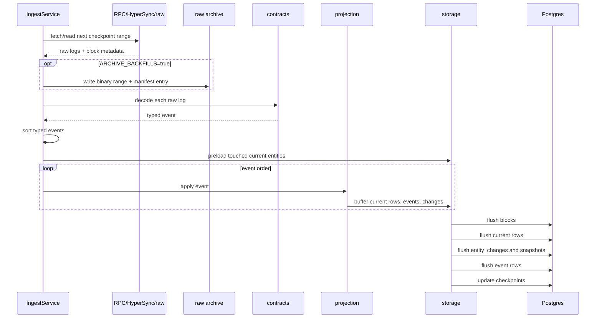
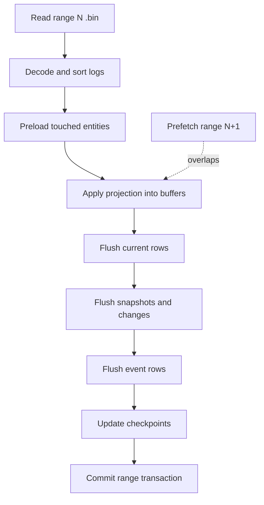

# Ingestion And Archives

The `ingest` crate is the write-side runtime. It fetches or reads logs, decodes them, applies projections, flushes storage batches, and advances checkpoints.

## Sources

| Source | Use Case | Notes |
| --- | --- | --- |
| RPC | Simple historical backfill. | Slower and credit-heavy for full history. |
| HyperSync | Fast historical backfill. | Requires `ENVIO_API_KEY`; useful for first full archive creation. |
| Raw archive | Repeat projection without network fetches. | Reads local binary `.bin` ranges. |
| Live RPC | Confirmed live indexing. | Uses confirmation depth and parent-hash checks. |

## Historical Flow



## Raw Archive Format

Raw archive directories contain:

```text
RAW_ARCHIVE_DIR/
  manifest.json
  ranges/
    {from_block:020}-{to_block:020}.bin
```

Each `.bin` file is a MessagePack-encoded `ArchivedRange` containing:

- `chain_id`;
- `from_block`;
- `to_block`;
- ordered raw logs with their `LogSource`;
- block metadata;
- checkpoint source names covered by the range.

`manifest.json` contains:

- range bounds;
- relative file path;
- SHA-256 checksum;
- byte size;
- raw log count;
- archive chain id.

JSON range payloads are no longer supported. JSON remains only for small metadata files.

## Resolver Discovery

ENS resolver contracts are dynamic. The indexer discovers resolver addresses from registry resolver events and includes resolver logs in later historical ranges. Binary archive ranges contain the raw logs needed for replay, so raw replay no longer depends on a sidecar resolver-cache file.

## Checkpointing

Checkpoints are stored per source, for example:

- old registry;
- current registry;
- base registrar;
- registrar controllers;
- name wrapper;
- resolver source groups.

RPC and HyperSync backfills start from the minimum next checkpoint across active sources. Raw replay starts from the same checkpoints but caps the target to archive coverage.

## Raw Replay Performance Path

Raw replay is the fastest path for projection iteration because it avoids network fetches and can optimize storage writes:

1. Inspect archive bounds and source checkpoints.
2. Drop secondary query indexes before bulk replay only when the requested range spans more than 500,000 blocks.
3. Keep a replay-level entity cache across range files.
4. Prefetch the next `.bin` range while applying the current range.
5. Wrap each raw range in one Postgres transaction.
6. Set `synchronous_commit=off` inside the raw range transaction.
7. Flush current rows, snapshots, entity changes, event rows, blocks, and checkpoints in batches.
8. Recreate query indexes after replay finishes.



### What These Optimizations Mean

If you are new to indexers, the raw replay path is easiest to think of as a warehouse receiving boxes:

- The `.bin` range file is the box of logs.
- Decode opens the box and identifies what each log means.
- Preload asks Postgres for the rows that are probably needed before the work starts.
- Projection updates an in-memory workbench instead of walking to the database for every log.
- Flush writes the finished piles back to Postgres in large batches.

The main production tricks are:

| Trick | Plain Meaning | Why It Is Faster |
| --- | --- | --- |
| Next-range prefetch | Read the next archive file while the current file is being projected. | Disk IO overlaps with CPU/SQL work. |
| Replay-level cache | Keep known current rows in memory across range files. | Hot domains/resolvers/accounts are not reloaded every file. |
| Touched-entity preload | Batch-load rows that this range will probably touch. | Replaces many tiny point queries with fewer set queries. |
| Range transaction | Commit one archive range at a time. | Reduces commit overhead and keeps checkpointing atomic per range. |
| `synchronous_commit=off` | Let raw replay avoid waiting for every commit flush. | Improves replay throughput in a rebuildable local/archive-backed workflow. |
| Temporary index drop | Remove read indexes before huge replays over 500,000 blocks, rebuild after. | Bulk index creation is cheaper than maintaining indexes row by row for large backfills; short catchups keep indexes available. |

These are replay optimizations, not shortcuts in projection semantics. The same ordered logs still pass through the same projection handlers.

## Failure And Resume Behavior

- Archive writes use a temp file and rename.
- Manifest entries include checksums.
- Raw replay verifies ranges before applying them.
- Checkpoints update after the range flushes.
- If a replay is interrupted mid-range, the next run resumes from checkpoints and can re-apply the partially attempted range idempotently.
- If a large raw replay is interrupted after secondary indexes were dropped, recreate indexes before benchmarking query latency.

## Current Limitations

- Raw replay does not yet have graceful shutdown that commits/aborts the active range cleanly before process exit.
- Live reorg recovery is coarse and rebuilds indexed state.
- Adaptive range sizing for extremely dense eras is future work.
- A fully transactional multi-connection storage executor would be cleaner than relying on the raw replay single-connection pool for range transaction batching.
