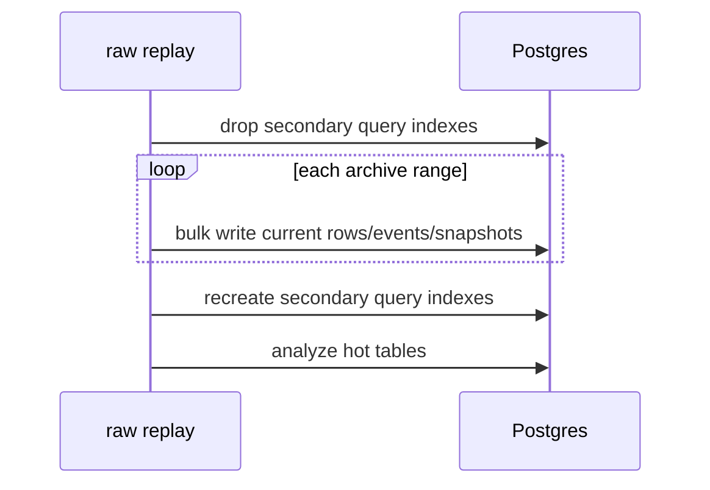

# Performance And Benchmarks

This page explains why the Rust indexer is fast, what indexes exist, and which parts are still worth improving. It is written for two readers:

- a new reader who wants the mental model without already knowing Postgres or The Graph internals;
- a mid-level engineer who wants enough technical detail to debug slow backfills or slow GraphQL queries.

Performance work has two separate goals:

1. Historical fill throughput: how quickly chain logs become database rows.
2. GraphQL read latency: how quickly clients can query those rows after the data is indexed.

Those goals conflict if handled carelessly. Indexes make reads fast, but indexes make writes slower because Postgres must update every relevant index on every inserted or updated row. A lot of the design is about keeping read indexes available for normal service while temporarily avoiding their write cost during large raw replays.

## Big Picture

```mermaid
flowchart LR
    Source["RPC / HyperSync / raw .bin"]
    Decode["decode logs"]
    Preload["preload touched rows"]
    Cache["projection cache"]
    Buffers["write buffers"]
    Tx["range transaction"]
    Indexes["query indexes"]
    API["GraphQL + DataLoader"]

    Source --> Decode --> Preload --> Cache --> Buffers --> Tx
    Tx --> Indexes
    Indexes --> API
```



The important idea is simple:

- During ingestion, do fewer database roundtrips and fewer index updates.
- During querying, give Postgres indexes that match real GraphQL access patterns.

## Historical Fill Optimizations

### Binary Raw Archives

Raw archives store fetched chain logs as local binary `.bin` range files. This separates expensive data acquisition from projection logic.

Without raw archives:

1. Fetch logs from RPC or HyperSync.
2. Decode.
3. Project.
4. Write.
5. If projection code changes, fetch logs again.

With raw archives:

1. Fetch logs once.
2. Store `.bin` files with checksums in `RAW_ARCHIVE_DIR/ranges`.
3. Replay the same local files repeatedly while changing projection/storage code.

This saves RPC/HyperSync credits and makes local correctness/performance iteration much faster.

### Range Transactions

Raw replay applies one archive range inside one database transaction. A transaction is a batch boundary: either the whole range commits, or none of it does.

Why this is faster:

- Postgres does less per-row commit bookkeeping.
- The indexer can set `synchronous_commit=off` for raw replay ranges, reducing disk sync pressure.
- Checkpoints advance only after all writes for the range are durable enough for this replay mode.

This is used only where the storage pool is constrained to a single connection for raw replay. RPC and HyperSync do not fake a transaction across multiple pooled connections.

### Preload Cache

Projection handlers often need to know the current row before applying an event. Example: a `NewOwner` event may need the parent domain, child domain, old owner, label metadata, and current subdomain counts.

The slow version is:

```text
for every event:
  query domain
  query account
  query resolver
  update one row
```

That becomes millions of point queries during a full backfill.

The indexer instead scans the decoded range first and collects the entity IDs it is likely to touch. Then it preloads those rows in batches:

```text
range logs -> collect touched ids -> load rows once -> project events from memory
```

The cache stores:

- existing rows found in Postgres;
- missing-row knowledge, so the same missing entity is not queried repeatedly;
- dirty rows that changed during projection and must be flushed later.

This converts repeated tiny database reads into fewer batched reads.

### Replay-Level Current-State Cache

The cache is kept across raw archive files during a replay. That matters because adjacent archive ranges often touch the same hot ENS entities:

- `.eth`;
- popular parent domains;
- active resolver contracts;
- accounts appearing across many registrar or wrapper events.

Keeping the cache across ranges avoids reloading the same current-state rows at the start of every file. Dirty rows still flush per range, but the in-memory knowledge survives.

### Batched Current-State Writes

Projection updates current entities such as `domains`, `accounts`, `resolvers`, `registrations`, and `wrapped_domains`. The slow version is one SQL statement per mutation. The fast version is:

```text
collect dirty accounts -> batch insert/upsert
collect dirty domains -> batch insert/upsert
collect dirty resolvers -> batch insert/upsert
...
```

The storage layer chunks batches so SQL stays below Postgres bind-parameter limits.

Domains are flushed parent-first because `domains.parent_id` is a self-reference. Parent-first flushing prevents foreign-key failures when a child and parent are both created in the same range.

### Batched Event Writes

ENS event history is append-only. Event rows are grouped by concrete table:

- `transfer_events`;
- `new_owner_events`;
- `name_registered_events`;
- `addr_changed_events`;
- and the other registry, registrar, wrapper, and resolver event tables.

Each table flushes many rows per statement instead of one row at a time. This is much cheaper for Postgres and keeps event-history writes predictable.

### Entity Changes And Snapshots

The official subgraph supports `_change_block` filters and historical `block` reads. This indexer supports those by writing:

- `entity_changes`: which entity changed at which block;
- snapshot rows: what the mutable entity looked like at that block.

A single entity can change multiple times inside one range. The change buffer deduplicates repeated marks before writing snapshots, so one noisy entity does not create unnecessary duplicate work.

### Temporary Secondary Index Drop/Recreate

Read indexes are expensive during bulk replay. Every insert/update must also update the indexes. For tens of millions of rows, this can dominate runtime.

Raw replay can drop secondary query indexes before replay and recreate them after replay:



Why this helps:

- During replay, writes touch fewer indexes.
- After replay, Postgres builds each index in one large scan, which is usually faster than maintaining it row by row.

Tradeoff:

- Query latency is bad while indexes are dropped.
- If the process is interrupted after dropping indexes, recreate them before benchmarking or serving public traffic.

### Range Prefetch

Raw replay reads one `.bin` file at a time, but it can start loading the next file while applying the current one. This overlaps disk IO with CPU and database work.

This does not change correctness. It only hides part of file-read latency.

## Query Index Catalog

This section lists the important index families and why they exist. The authoritative implementation lives in:

- `crates/storage/src/maintenance/replay_indexes/current.rs`;
- `crates/storage/src/maintenance/replay_indexes/events.rs`;
- `migrations/*.sql`.

### Domain Parent And Subname Indexes

| Index | Query Shape It Helps |
| --- | --- |
| `domains_parent_idx` | Basic `Domain.subdomains` lookup by parent id. |
| `domains_parent_label_name_sort_idx` | `domain.subdomains(orderBy: labelName)` without sorting millions of rows. |
| `domains_parent_name_sort_idx` | `domain.subdomains(orderBy: name)`. |
| `domains_parent_created_idx` | Parent-scoped ordering by `createdAt`. |
| `domains_parent_expiry_idx` | Parent-scoped ordering by `expiryDate`. |

Why this matters: `.eth` has millions of subdomains. A query such as `domain(id: eth).subdomains(first: 50, orderBy: labelName)` must not scan every domain in the database or sort all `.eth` children from scratch.

### Domain Owner And Address Indexes

| Index | Query Shape It Helps |
| --- | --- |
| `domains_owner_idx` | `domains(where: { owner: $address })`. |
| `domains_registrant_idx` | `domains(where: { registrant: $address })`. |
| `domains_wrapped_owner_idx` | `domains(where: { wrappedOwner: $address })`. |
| `domains_resolved_address_idx` | `domains(where: { resolvedAddress: $address })`. |
| `domains_resolver_idx` | `domains(where: { resolver: $resolver })`. |

These support direct relationship filters.

### ENSJS Names-For-Address Sort Indexes

| Index | Query Shape It Helps |
| --- | --- |
| `domains_owner_expiry_idx` | Owner lookup sorted by latest expiry. |
| `domains_registrant_expiry_idx` | Registrant lookup sorted by latest expiry. |
| `domains_wrapped_owner_expiry_idx` | Wrapped owner lookup sorted by latest expiry. |
| `domains_resolved_address_expiry_idx` | Resolved address lookup sorted by latest expiry. |
| `domains_owner_created_idx` | Owner lookup sorted by creation time. |
| `domains_registrant_created_idx` | Registrant lookup sorted by creation time. |
| `domains_wrapped_owner_created_idx` | Wrapped owner lookup sorted by creation time. |
| `domains_resolved_address_created_idx` | Resolved address lookup sorted by creation time. |

ENSJS-style names-for-address queries often ask:

```graphql
domains(
  where: {
    and: [
      { or: [{ owner: $addr }, { registrant: $addr }, { wrappedOwner: $addr }, { resolvedAddress: $addr }] }
      { or: [{ expiryDate_gt: $now }, { expiryDate: null }] }
    ]
  }
  orderBy: expiryDate
  orderDirection: desc
)
```

The storage layer detects this shape and emits a direct indexed plan over the four address columns. The compound expiry/created indexes let Postgres find already-sorted candidates instead of collecting and sorting huge intermediate sets.

### Exact Name And Label Indexes

| Index | Query Shape It Helps |
| --- | --- |
| `domains_name_md5_idx` | Exact `name` lookup using `md5(name)`. |
| `domains_label_name_md5_idx` | Exact `labelName` lookup using `md5(label_name)`. |
| `domains_name_md5_id_idx` | Exact name lookup plus stable id tie-break. |
| `domains_label_name_md5_id_idx` | Exact label lookup plus stable id tie-break. |
| `domains_labelhash_idx` | Fixed-size labelhash lookup. |
| `domains_bracketed_labelhash_idx` | Bracketed unknown-label lookup like `[abcdef...]`. |

Why use `md5(name)` instead of a normal btree index on `name`?

ENS names and labels are on-chain text and can be long. Postgres btree index entries have size limits. A direct btree index on arbitrary text can fail with large values. Hash expression indexes keep exact lookup fast without risking oversize index rows.

Correctness is preserved by rechecking the original text:

```sql
md5(name) = md5($value) and name = $value
```

The hash narrows candidates quickly; the exact comparison prevents hash-collision mistakes.

### Trigram Search Indexes

| Index | Query Shape It Helps |
| --- | --- |
| `domains_name_trgm_idx` | `name_contains`. |
| `domains_name_lower_trgm_idx` | `name_contains_nocase`. |
| `domains_label_name_trgm_idx` | `labelName_contains`. |
| `domains_label_name_lower_trgm_idx` | `labelName_contains_nocase`. |
| `domains_parent_name_trgm_idx` | Parent-scoped `name_contains`. |
| `domains_parent_name_lower_trgm_idx` | Parent-scoped `name_contains_nocase`. |
| `domains_parent_label_name_trgm_idx` | Parent-scoped `labelName_contains`. |
| `domains_parent_label_name_lower_trgm_idx` | Parent-scoped `labelName_contains_nocase`. |

Trigram indexes split text into small chunks and make substring search indexable. This is what makes queries like `labelName_contains_nocase: "vitalik"` practical.

The parent-scoped trigram indexes matter for `Domain.subdomains(where: { labelName_contains_nocase: ... })`. They let Postgres search inside one parent, such as `.eth`, instead of considering all domains first.

Limitation: extremely broad searches such as `"a"` or `"art"` can still return many candidates. The index finds candidates quickly, but the database may still need to fetch and sort many rows. That is why broad text search remains one of the local query outliers.

### Registration, Wrapper, And Resolver Indexes

| Index | Query Shape It Helps |
| --- | --- |
| `registrations_domain_idx` | `Domain.registration` and registration relationship filters. |
| `registrations_registrant_idx` | Registrations by registrant account. |
| `registrations_registration_date_idx` | Registration date ordering/filtering. |
| `registrations_expiry_date_idx` | Expiry date ordering/filtering. |
| `registrations_label_name_md5_expiry_idx` | Exact label lookup plus expiry sorting. |
| `wrapped_domains_domain_idx` | `Domain.wrappedDomain`. |
| `wrapped_domains_owner_idx` | Wrapped domains by owner. |
| `resolvers_domain_idx` | Resolver lookup by domain. |
| `resolvers_address_idx` | Resolver lookup by contract address. |

These make nested GraphQL fields and trailing-underscore relationship filters usable on full-mainnet data.

### Historical And Change Indexes

| Index | Query Shape It Helps |
| --- | --- |
| `account_snapshots_block_idx` | Historical account reads. |
| `domain_snapshots_block_idx` | Historical domain reads. |
| `registration_snapshots_block_idx` | Historical registration reads. |
| `wrapped_domain_snapshots_block_idx` | Historical wrapped-domain reads. |
| `resolver_snapshots_block_idx` | Historical resolver reads. |
| `entity_changes_lookup_idx` | `_change_block` filters. |

Historical `block` queries ask: "What was the latest snapshot for this entity at or before block N?" The block indexes make that lookup feasible.

### Event Parent And Block Indexes

Every concrete event table has indexes in two broad categories:

| Index Shape | Query Shape It Helps |
| --- | --- |
| `(domain_id)` or `(registration_id)` or `(resolver_id)` | Event history for one parent entity. |
| `(domain_id, id)` or `(registration_id, id)` or `(resolver_id, id)` | Derived event collections with stable ordering/pagination. |
| `(block_number)` | Event scans, historical block clamping, recent activity queries. |

Examples:

- `transfer_events_domain_id_idx`;
- `name_registered_events_registration_id_idx`;
- `addr_changed_events_resolver_id_idx`;
- `text_changed_events_block_idx`;
- `version_changed_events_resolver_id_idx`.

These are what make fields like `Domain.events`, `Registration.events`, and `Resolver.events` fast enough to expose as GraphQL relationship fields.

## Clever Query Approaches

### ENSJS Address Fast Path

The official-style GraphQL filter for names-for-address is expressive but expensive if translated naively. It has nested `and`/`or` groups across four possible address relationships.

The storage layer detects the common shape and runs a purpose-built query that still returns the same semantic result. This is not a schema shortcut; it is an SQL planning shortcut.

Result from local full-mainnet measurements:

- before optimization: multi-second plans were possible;
- after optimization: roughly `18-22ms`, then roughly `5ms` in later relationship-batching slices.

### DataLoader Batching

GraphQL makes it easy to ask for nested fields:

```graphql
domains(first: 100) {
  name
  owner { id }
  resolver { address }
  registration { expiryDate }
  wrappedDomain { fuses }
}
```

The slow implementation does one query for the domains, then one query per nested field per domain. That is the classic N+1 query problem.

The API uses `async-graphql` DataLoader for hot `Domain` relationships:

- `owner`;
- `resolvedAddress`;
- `registrant`;
- `wrappedOwner`;
- `resolver`;
- `registration`;
- `wrappedDomain`.

Instead of 100 owner queries, it sends one batched owner lookup for all requested owner IDs. This especially helps search and subname queries that return many domains with nested relationship fields.

### Static Order Expressions

GraphQL lets callers choose `orderBy`, but the SQL layer does not interpolate arbitrary strings. Each allowed order enum maps to a known SQL expression.

This keeps ordering compatible with the subgraph while avoiding unsafe dynamic SQL and making it clear which order fields need indexes.

## Benchmark Model

Benchmark fixtures live in [`../benchmarks/queries`](../benchmarks/queries), with the report in [`../benchmarks/README.md`](../benchmarks/README.md).

Timing columns:

- `ensindexer-rs`: local in-process compute time through `async-graphql` and Postgres.
- `ensnode`: hosted ENSNode public endpoint, baseline-adjusted when provider timing is absent.
- `the graph indexer`: hosted The Graph gateway, baseline-adjusted when provider timing is absent.

Hosted endpoints include internet and provider routing noise. The report subtracts a lightweight `_meta` baseline when provider execution timing is not exposed.

## Current Benchmark Summary

From the current production benchmark report:

| Operation | Local Result |
| --- | ---: |
| domain batch | ~6ms |
| ENSJS names-for-address | ~19ms baseline, later slice ~5ms after relationship batching |
| `eth` subnames | ~31ms baseline, later slice ~7ms after relationship batching |
| decoded label lookup | ~2ms |
| resolver records | ~11ms |
| registrations | ~9ms |
| name history | ~6ms |
| event scan | ~28ms |
| relationship filter | ~7ms |
| broad subname/text search | ~160-173ms |

The broad substring searches are the remaining local query outliers. Parent-scoped trigram indexes now make rare `.eth` subname searches use a direct parent+label bitmap plan, but very broad searches still fetch/sort many matching rows. They likely need a search-specific design rather than more generic btree indexes.

## Benchmark Comparison Table

The full table with relative speedups is maintained in [`../benchmarks/README.md`](../benchmarks/README.md). The table uses:

```text
operation | ensindexer-rs | ensnode | the graph indexer
```

Each numeric cell includes relative speed against the slowest supported result in that row.

## How To Add A Benchmark

Add:

```text
benchmarks/queries/12-new-workload.graphql
benchmarks/queries/12-new-workload.variables.json
```

Keep fixtures canonical to this indexer's official-compatible schema. If ENSNode cannot run a query, mark it `unsupported` in reports instead of weakening the canonical query.

## Future Performance Work

- Add per-table flush timing inside current-state, event, and snapshot flushes.
- Add query-plan regression tests for hot GraphQL workloads.
- Evaluate Postgres `COPY` or staging-table merge paths for dense replay.
- Evaluate unlogged or partitioned staging during historical replay.
- Add adaptive range sizing for dense eras.
- Build a search-specific path for broad substring workloads.
- Add graceful shutdown so interrupted raw replay can restore indexes automatically.
