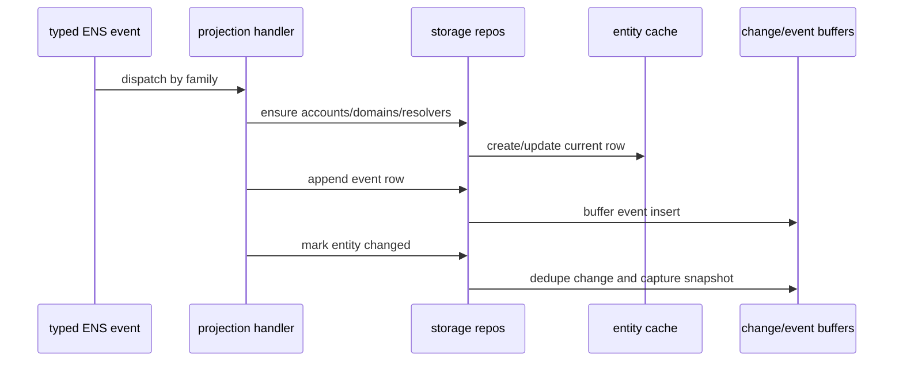
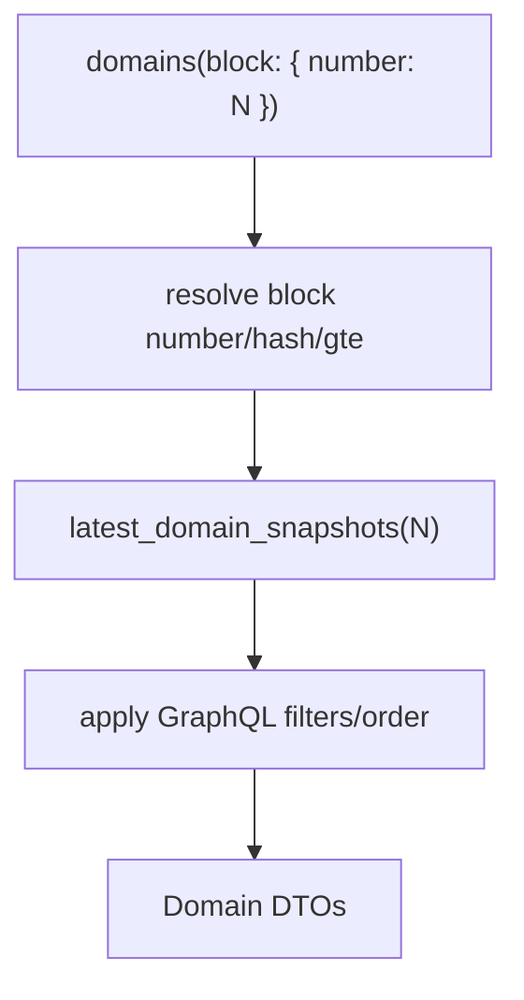

# Projection And Storage

Projection turns decoded ENS events into the same entity and event model exposed by the official ENS subgraph.

## Entity Model

Current entities:

| Entity | Purpose |
| --- | --- |
| `Account` | Ethereum address referenced by ownership, resolver address, registration, or wrapper state. |
| `Domain` | Namehash node state: owner, parent, label, resolver, TTL, registrar/wrapper links, expiry. |
| `Registration` | `.eth` registrar state keyed by labelhash. |
| `WrappedDomain` | Name Wrapper state: wrapped owner, fuses, expiry, decoded name. |
| `Resolver` | Resolver records for a `(resolver address, node)` pair. |

Operational tables:

- `blocks`;
- `source_checkpoints`;
- `entity_changes`;
- `label_preimages`.

Historical snapshot tables:

- `account_snapshots`;
- `domain_snapshots`;
- `registration_snapshots`;
- `wrapped_domain_snapshots`;
- `resolver_snapshots`.

## Event Families

| Family | Examples | Main Parents |
| --- | --- | --- |
| Registry/domain | transfer, new owner, new resolver, new TTL | `Domain` |
| Registrar | name registered, renewed, transferred | `Registration` |
| Name wrapper | wrapped transfer, name wrapped/unwrapped, fuses, expiry | `Domain`, `WrappedDomain` |
| Resolver | addr, multicoin, name, ABI, pubkey, text, contenthash, interface, authorisation, version | `Resolver` |

## Projection Flow

Projection handlers follow official-subgraph semantics:

- Registry events update `Domain` owner, parent, labelhash, resolver, TTL, migration flag, and domain events.
- Registrar events update `Registration`, `Domain.registrant`, `Domain.expiryDate`, and registration events.
- Wrapper events update `WrappedDomain`, `Domain.wrappedOwner`, fuses, expiry, and wrapper events.
- Resolver events update `Resolver` records and resolver events.
- Account rows are created for every address relationship.
- Label preimages observed from registrar/controller/wrapper events are saved and reused for later registry labels.
- Unknown labels fall back to bracketed labelhash notation.

## Write Buffers

The storage layer uses three main buffers during historical fills:

| Buffer | Purpose |
| --- | --- |
| `EntityCache` | Holds current entity rows and dirty sets for batched upserts. |
| `EventBuffer` | Holds append-only event rows by table. |
| `ChangeBuffer` | Holds deduplicated entity changes and historical snapshots. |

Flush order matters:

1. `blocks`
2. current rows, with `accounts` before relationships and domains parent-first
3. `entity_changes`
4. snapshot rows
5. event rows
6. source checkpoints

This order keeps foreign keys valid and keeps historical reads aligned with current-state mutations.

## Historical Reads

The API supports `block` arguments through stored snapshots.

Mutable entity roots use latest snapshots at the requested block. Event roots clamp by `block_number <= requested_block`. Singular event roots return `null` when the requested block predates the event.

## Label Handling

Name decoding uses three sources:

1. Hardcoded known labels such as `eth`, `reverse`, `addr`, `resolver`, and `migrated`.
2. Observed label preimages from registrar/controller and wrapper events.
3. Bracketed fallback labels such as `[abcdef...]`.

External ENSRainbow-style healing is intentionally not part of the production CLI. Future local-file healing should stay as a separate maintenance tool unless it becomes an intentionally supported runtime surface.

## Important Storage Optimizations

### Current-State Projection Cache

Projection needs current rows to decide how an event changes state. For example, a domain event may need the current domain row, parent row, owner account, resolver row, and label preimage.

Without a cache, projection would repeatedly query Postgres for the same rows. The cache changes that pattern:

1. Load rows once when a range starts or when a new touched entity is discovered.
2. Apply many events against cached rows.
3. Mark changed rows dirty.
4. Flush dirty rows in batches.

This is faster because memory reads are cheap and database roundtrips are expensive.

### Batched Flushes

The storage layer groups writes by purpose:

| Batch | What It Writes | Why It Exists |
| --- | --- | --- |
| current rows | accounts, domains, registrations, wrapped domains, resolvers | Keeps latest entity state current. |
| events | append-only event tables | Preserves official subgraph event history. |
| changes | `entity_changes` | Powers `_change_block` filters. |
| snapshots | historical entity state | Powers `block` reads. |
| blocks/checkpoints | chain metadata and progress | Powers `_meta`, resume, and live safety. |

Dirty rows flush once per range instead of once per event. Event rows are grouped by concrete table and inserted in chunks. Block metadata is batch-upserted.

### Snapshot Dedupe

The same entity can change multiple times in one range. The change buffer deduplicates repeated entity-change marks before snapshot capture. This avoids writing redundant snapshots while still preserving block-level history.

### Parent-First Domain Flush

`domains.parent_id` references another row in `domains`. If a parent and child are both new in one range, writing the child first can violate the foreign key. Domain flushes therefore write parent domains before child domains.

### Temporary Index Maintenance

Secondary query indexes are valuable for reads, but expensive for bulk writes. Raw replay can drop those indexes, write the bulk data, then recreate the indexes afterward. The detailed index catalog and the reasoning behind each index family are in [Performance And Benchmarks](performance-and-benchmarks.md).

## Current Correctness Gaps

The storage/projection model is functional, but these items still need deeper validation:

- seeded fixture tests for all historical `block` forms;
- official/local differential projection reports;
- recursive relationship filter edge audits;
- efficient common-ancestor rollback for live reorgs;
- stronger graceful shutdown around active raw replay ranges.
